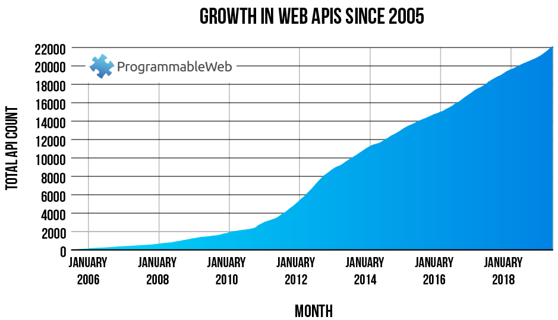

# Servicios de Datos: Conceptos y Tecnologías

## Objetivos

Un servicio de datos tiene como fin integrar los recursos de un sistema con aplicaciones y sistemas externos.

En el contexto de la AAPS, el fin de implementar un serivicio de datos es doble:

1. La creación de **aplicaciones** que apoyen las tareas de sus funcionarios.
2. La **interoperabilidad** de de los sistemas de la institución con sistemas y aplicaciones externas.

!!!tip "Alerta Técnica"
    A partir de este punto discutimos aspectos técnicos relacionados con las decisiones de arquitectura y tecnologías utilizadas para la implementación del sistema FastAAPS. 

    Estos temas son de importancia fundamentalmente para desarrolladores y personal de asistencia técnica.

## Situación Actual Global

Durante los últimos años a nivel mundial, la necesidad de integrar sistemas y crear aplicaciones en base a los recursos de distintos sistemas, motivó el desarrollo de servicios REST-API en grandes cantidades.

(Fuente: [programmable web directory](https://www.programmableweb.com/apis/directory))

### Dificultades y Problemas de Uso

Junto con el crecimiento en número y diversidad de servicios de acceso programáticos viene la necesidad de específicar estos servicios con el fín que los clientes del API sepan cómo interactuar con el servicio y qué esperar cómo respuesta. 

Por muchos años, a falta de un concenso claro en la industria, los servicios API recurrieron a específicar sus servicios API en distintos formatos o simplement en páginas de documentación orientadas hacia los desarrolladores.  

Si bien este método logra el cometido de poder hacer uso del API, conlleva serios problemas y dificultades:

1. El cliente no cuenta con ninguna garantía de que la documentación coincida con el servicio. La documentación puede no estar actualizada, estar incompleta o simplemente estar fallida.

2. El formato de diversos servicios no es estandarizado, lo cual dificulta la creación de herramientas automatizadas generales y obliga al cliente aprender el método específico utilizado para cada servicio. 

## Estándares Actuales

Existen varios estándares de comunicación web que buscan solucionar el problema fundamental de integración de sistemas y la popularidad de estos estándares varía en función a los avances y adopción de las tecnologías en la industria. Los estándares actuales más relevantes en base a su adopción en la industria son: [REST](https://en.wikipedia.org/wiki/Representational_state_transfer), [GraphQL](https://graphql.org/) y [gRPC](https://grpc.io/about/).

!!!note "Nota: Estándares de Legado"
    Otros estándares que fueron en su momento altamente relevantes son [CORBA](https://es.wikipedia.org/wiki/CORBA) y [SOAP](https://en.wikipedia.org/wiki/SOAP). Hoy en día son pocos los nuevos sistemas implementando estos estándares.

A continuación describimos los estándares actuales a grandes rasgos. 

### REST

REST (cuyas siglas en inglés significan *Representational State Transfer* o en español *Transferencia de Estado Representado*) es una arquitectura de software para la creación de servicios web que define restricciones de diseño con el fin de adecuar un servicio web a las necesidades y usos modernos.

A pesar de no limitar el protocolo de transferencia o el formato de la información transmitida, en la gran mayoría de sus implementaciones, el protocolo utilizado es HTTP y el formato de datos es JSON (o en menor medida XML).

Actualmente es el estándar de servicios web más utilizado en la industria.

### GraphQL

GraphQL (cuyas siglas en inglés significan *Graph Query Language* o en español *Lenguaje de Consulta de Grafos*) es una especificación desarrollada originalmente de manera interna por Facebook que luego fué publicada como una especificación abierta.

GraphQL ofrece una especificación completa del servicio de datos, incluyendo métodos que puede usar el cliente para realizar consultas de datos complejas. También especifica metodos de implementación del servicio.

A diferencia de un REST-API, que ofrece puntos de acceso claramente definidos y limitados, GraphQL permite realizar consultas complejas que pueden incluir agregación de distintos recursos. Esta flexibilidad puede facilitar el uso del servicio y ofrecer ventajas de desempeño, al costo de dificultar la implementación y mantenimiento del servicio.

GraphQL es utilizado por varias grandes compañías y su popularidad está aumentando con el paso del tiempo.

### gRPC

gRPC (cuyas siglas en inglés significan *gRPC Remote Procedure Calls* o en español *Llamadas a Procedimientos Remotos gRPC*) es una especificación desarrollada originalmente de manera interna por Google que luego fué publicada como una especificación abierta.

gRPC ofrece una especificación para la integración de servicios web basada en el protocolo de transporte HTTP/2 y un método de serialización de datos estrucurados, *Protocol Buffers*, cómo formato de transporte.

A diferencia de un REST-API, gRPC ofrece características adicionales que normalmente deberían ser implementadas por el proveedor tales como métodos de autenticación, streams bidireccionales y tiempos de cancelación de pedidos entre otras. 

gRPC es normalmente utilizado para la integración de servicios y dispositivos bajo una arquitectura de *microservicios*. 

