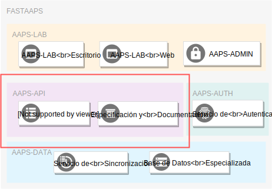

# AAPS-API: Resúmen Ejecutivo

Bienvenido a la documentación del componente de acceso de datos *AAPS-API*!

## General

El sistema [**AAPS-API**](./summary.md) ...

* Proporciona un servicio web de datos basado en especificaciones abiertas modernas que permite a aplicaciones y sistemas externos acceder a los conjuntos de datos de la AAPS almacenados en el componente [**AAPS-DATA**](../AAPS-DATA/summary.md).

* Utiliza el servicio de autenticación y autorización ofrecido por el componente [**AAPS-AUTH**](../AAPS-AUTH/summary.md) para controlar el acceso hacia los recursos de la institución.

* Brinda sus servicios a las aplicaciones del componente [**AAPS-LAB**](../AAPS-LAB/summary.md).  

* Ofrece a una aplicación web que permite explorar los puntos de acceso de manera interactiva. Esta aplicación sirve de especificación técnica completa del servicio de datos y al mismo tiempo sirve de documentación para sus usuarios. 

## Objetivos

Un servicio de datos tiene como fin integrar los recursos de un sistema con aplicaciones y sistemas externos.

En el contexto de la AAPS, el fin de implementar un serivicio de datos es doble:

1. La creación de **aplicaciones** que apoyen las tareas de sus funcionarios.
2. La **interoperabilidad** de de los sistemas de la institución con sistemas y aplicaciones externas.
