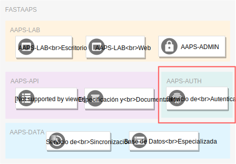

# AAPS-AUTH: Resúmen Ejecutivo

Bienvenido a la documentación del componente de autenticación y autorización *AAPS-AUTH*!

## General

El sistema [**AAPS-AUTH**](./summary.md)...

* Proporciona un servicio web de autenticación y autorización basado en especificaciones abiertas hacia los conjuntos de datos de la institución almacenados en el componente [**AAPS-DATA**](../AAPS-DATA/summary.md).

* Ofrece puntos de acceso que le permiten a aplicaciones y sistemas externos intercambiar credenciales de autenticación (nombre de usuario y contraseña) por llaves de acceso que luego pueden ser usadas para acceder a los recursos proporcionados por el componente [**AAPS-API**](../AAPS-API/summary.md).

