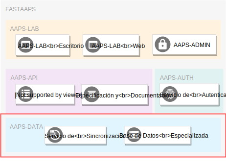

# AAPS-DATA: Conjuntos de Datos

El componente AAPS-DATA almacena y sincroniza conjuntos de datos correspondientes a distintos sectores de la AAPS.
A continucación describimos estos conjuntos de datos a detalle.

## 1 Licencias y Registros - EPSAs Registradas

Los siguientes conjuntos de datos corresponden a las EPSAs registradas y son utilizados en los procesos de la jefatura de constitución de licencias y registros (L&R) de la AAPS.

Las fuentes oficiales de los datos son el SIIRAyS a través de su módulo de regularización y archivos georeferenciados administrados por el área de tecnologías de la información y comunicación (TIC) de la AAPS.

Los conjuntos de datos relacionados a las EPSAs registradas son los siguientes:

1. **Registro EPSAs**: Información general de EPSAs registradas.
2. **Áreas de Prestación de Servicio**: Datos georeferenciados de las áreas de prestación de servicio de las EPSAs registradas.
3. **Tanques de Almacenamiento**: Datos georeferenciados de los tanques de almacenamiento de las EPSAs registradas.
4. **Fuentes de Abastecimiento**: Datos georeferenciados de las fuentes de abastecimiento de las EPSAs registradas.

### 1.1 Registro EPSAs 

Este conjunto de datos corresponde a los datos proporcionados por las EPSAs a través de los formularios de solucitud de registro. Es administrado por la jefatura de Constitución de Licencias y Registros (L&R) de la AAPS y es almacenado en la base de datos del sistema SIIRAyS, ingresado y escaneado a través de su aplicación web.

Todos los datos del formulario de registro son incluídos en este conjunto de datos con excepción de los datos georeferenciados de áreas de cobertura, fuentes de abastecimiento y tanques de almacenamiento que constituyen conjuntos de datos separados propios.  
