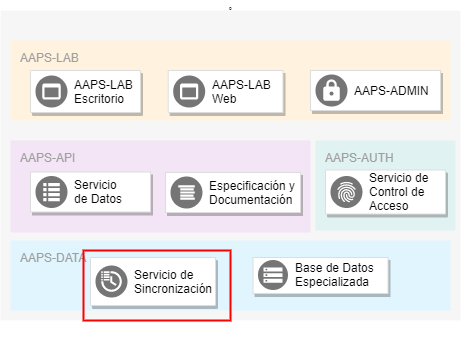

# AAPS-DATA: Servicio de Sincronización de Datos

## 1. General

El **Servicio de Sincronización de Datos** del componente AAPS-DATA, se encarga de sincronizar los datos del componente con los datos de diversas fuentes externas, principalmente con los datos del sistema SIIRAyS.

El [Servicio de Sincronización](/AAPS-DATA/sync), tanto de manera automática periódica como de manera manual a través de la aplicación de control de tareas, se encarga de:

1. Acceder a estos datos, a través de un driver para la base de datos Postgres.

2. Transformar los datos al formato del sistema.

3. Ingresar los datos al sistema FASTAAPS a través del servicio de acceso.

Una vez ingresados al sistema estos datos pueden ser utilizados por las aplicaciones.

## 2. Fuentes Originales de Datos

Las fuentes originales de los datos de la AAPS son aquellas administradas por sus direcciones, a través de sus planillas excel, sistema SIIRAyS, los archivos georeferenciados o cualquier otro método considerado necesario para el manejo apropiado de sus datos. El sistema FASTAAPS simplemente almacena, distribuye y utiliza estos datos con el fin de facilitar las tareas de los funcionarios de la AAPS.

## 3. Funciones

El servicio de sicronización se encarga de las siguientes funciones:

1. **Sincronización Periódica con el SIIRAyS**: Para asegurar que los datos utilizados por las aplicaciones se encuentren actualizados y repliquen fielmente el estado del SIIRAyS, el servicio de sincronización tiene una función que accesa de manera periódica y automática a la base de datos del sistema SIIRAyS y releva los datos más actuales.

2. **Sincronización a Pedido**: En caso de que sea necesario relizar una actualización a pedido, el servicio de sincronización ofrece esta función a través de su interfaz de monitoreo.

### 3.1 Propiedades de las Funciones

Para asegurar la consistencia del sistema, requerimos que todas las funciones del servicio de sincronización cumplan dos características fundamentales: Atomicidad e Idempotencia. Estas propiedades garantizan la consistencia del servicio, evitando entrar en estados inconsistentes y de esta manera reducir errores imprevistos.

1. **Atomicidad**: Una función atómica es aquella que es aplicada en su totalidad o no es aplicada en lo absoluto. 
 Es decir, al aplicar una función atomica todos sus subprocesos persistentes son aplicados en el orden correcto en el caso exitoso mientras que, en caso de fallar algún subproceso, ninguno de los subprocesos persistentes es aplicado.

En lenguaje simple se puede entender a una función atómica, como una que no deja rastros "a medias". 

2. **Idempotencia**: Con una función idempotente se obtiene el mismo resultado, independientemente de las veces que la función sea repetida. 
 Es decir, aplicar una función idempotente una vez es equivalente a aplicarla dos o más veces. 
 

En caso de extender el serivicio de sincronización añadiendo nuevas tareas, recomendamos que las nuevas funciones cumplan con estas dos características.

## 4. Tecnologías Utilizadas

A continuación describimos las tecnologías utilizadas para el servicio de sincronización. Todas las librerías de código utilizado por las siguientes herramientas son del tipo "open source" o "código abierto".

### 4.1 Celery: Sistema de Tareas Asincrónicas

Celery es un conjunto de herramientas (framework) utilizado para correr tareas específicas de manera asincrónica, es decir, en otro proceso o inclusive en otro servidor dedicado. Normalmente es usado para correr tareas pesadas y de mantenimiento, que resultarían inconvenientes de ser incluídas en una aplicación web. 

El modelo de trabajo de celery gira entorno a una **fila de tareas**, en dónde las aplicaciones ingresan las tareas que deben ser realizadas. Esta fila de tareas es observada por **procesos trabajadores** que reciben las tareas y las procesan por su cuenta. 

Las tareas de sincronización con la base de datos del SIIRAyS califican a ser implementadas usando el modelo de trabajo de Celery porque las siguientes características:

* Las tareas de sincronización son pesadas. Pueden tardar varios segundos en ser procesadas.
* Las tareas de sincronización pueden ser ejecutadas de manera asincrónica.
* Los objetos involucrados en estas tareas son ajenos al resto de componentes del sistema.

Para el servicio de sincronización periódico utilizamos una herramienta automatizada para añadir tareas a la fila en intervalos regulares. Esta herramienta es implementada en un proceso aparte y la describimos en mayor detalle más adelante. 

Celery utiliza procesos del tipo *trabajador* (worker) que corren de manera paralela y están pendientes de las tareas que tengan que ser ejecutadas. Como la mayoría de los servicios del sistema FASTAAPS y de acuerdo a los factores mencionados en la sección de [cálidad de código](/FASTAAPS/quality), los procesos trabajadores de Celery son contenerizados con Docker. 

Celery no implementa la fila de tareas, en cambio, depende de los servicios de un **agente de mensajería** (message broker) externo para transmitir mensajes a los procesos trabajadores. El uso de un agente de mensajería externo tiene la ventaja de usar una tecnología especializada. Más adelante explicamos el agente de mensajería en mayor detalle.

  

### 4.2 RabbitMQ: Agente de Mensajería (Fila de Tareas)

El sistema de Celery depende de un agente de mensajería (message broker) externo para implementar la fila de tareas.  

Existen distintos serivicios de mensajería como por ejemplo [Redis](https://redis.io/) o una base de datos convencional, pero el sistema FASTAAPS utiliza el servicio de mensajería [RabbitMQ](https://www.rabbitmq.com/), el cual es el más completo en cuanto a funcionalidades de Celery.

Como la mayoría de los servicios del sistema FASTAAPS y de acuerdo a los factores mencionados en la sección de [cálidad de código](/FASTAAPS/quality), el agente de mensajería es contenerizado con Docker. De acuerdo con estos principios de diseño el agente de mensajería es accesible desde los contenedores que lo requieran (trabajadores Celery) en un puerto específico.

Para monitorear el trabajo realizado por el agente de mensajería y facilitar su mantenimiento, incluímos un panel de control web desde el cual un usuario de apoyo técnico puede monitorear la fila de tareas en tiempo real. Este servicio es parte del contenedor de RabbitMQ.

### 4.3 Celery-Beat: Herramienta de Tareas Periódicas

Teniendo procesos trabajadores de Celery a la espera de nuevas tareas a realizar en la fila, sólo nos hace falta una herramienta encargada de poner tareas en la fila en intervalos regulares. Precisamente esta es la función de **Celery-Beat**, una herramienta de Celery que inicia un nuevo proceso con el fin de añadir tareas a la fila de manera periódica.

Como la mayoría de los servicios del sistema FASTAAPS y de acuerdo a los factores mencionados en la sección de [cálidad de código](/FASTAAPS/quality), la herramienta de tareas periódicas es contenerizada con Docker.

### 4.4 Flower: Interfaz de Monitoreo

Para monitorear el trabajo realizado por el servicio de sincronización y facilitar su mantenimiento, el servicio de sincronización cuenta con una interfaz de usuario web desde la cual un usuario de apoyo técnico puede monitorear las tareas realizadas en tiempo real.

La interfaz de monitoreo fue implementada haciendo uso de la librería [Flower](https://flower.readthedocs.io/).

Como la mayoría de los servicios del sistema FASTAAPS y de acuerdo a los factores mencionados en la sección de [cálidad de código](/FASTAAPS/quality), la herramienta de monitoreo de tareas es contenerizado con Docker y el panel de control es expuesto en un puerto específico.

El acceso al panel de control es considerado del tipo administrativo/técnico y se encuentra protegido por un sistema de autenticación básico (nombre de usuario & contraseña). 

### 4.5 PgBouncer: Gestor de Conexiones a la Base de Datos PostgreSQL

Establecer una conexión con un servidor PostgreSQL es notoriamente costoso:

* **Memoria**: Cada conexión de PostgreSQL inicia un nuevo proceso que requiere una asignación de aproximadamente 10MB de memoria.
* **Procesamiento Computacional**: Iniciar nuevas conexiones además implica un gasto adicional en tiempo de cómputo.

Debido a estos costos, no sería eficiente establecer una conexión nueva con la base de datos cada vez que comienze una tarea de sincronización. En especial si estas conexiones son de vida corta y son destruidas una vez completada la tarea.

La solución a este problema es crear y mantener un grupo conexiones de larga duración (connection pool) que sean reutilizadas por los procesos trabajadores. Precisamente esta es la función de un **gestor de conexiones (connection pooler)** como [PgBouncer](http://www.pgbouncer.org/).

El flujo de trabajo es el siguiente:

1. El gestor de conexiones establece y mantiene conexiones directas hacia la base de datos del SIIRAyS y proporciona estas conexiones como servicio. 
2. Las tareas de Celery se conectan con el gestor como si este fuera la base de datos y realizan sus consultas.
3. El gestor utiliza una de las conexiones que mantiene para realizar el pedido a la base de datos real y retorna el resultado de la consulta a la tarea.
4. La conexión es retornada al grupo de conexiones para que esta pueda ser utilizada nuevamente.

Como la mayoría de los servicios del sistema FASTAAPS y de acuerdo a los factores mencionados en la sección de [cálidad de código](/FASTAAPS/quality), el servicio de gestión de conexiones es contenerizado con Docker.

### 4.3 PsycoPG2: Driver de PostgreSQL

### 4.4 Requests: Cliente HTTP 

## 5. Detalles de Implementación

El servicio de sincronización está implementado a través de los siguientes servicios Docker:

Nombre del Servicio  | Descripción  | Tecnología Utilizada  
------------ | ------------- | ------------ 
rabbitmq  | Agente de mensajería (message broker) |  [RabbitMQ](https://www.rabbitmq.com/)   
celery  | Proceso trabajador de Celery | [Celery Worker](http://www.celeryproject.org/)
flower | Herramienta de monitorero de Celery | [Flower](https://flower.readthedocs.io/)
beat |  Herramienta de tareas periódicas de Celery | [Celery Beat](http://www.celeryproject.org/)
pgbouncer | Gestor de conexiones (connection pooler) | [PgBouncer](http://www.pgbouncer.org/)

Cada servicio corre en un proceso aislado, pero exponen los siguientes puertos dentro del servidor:

Puerto | Protocolo | Servicio Docker | Descripción
----- | ----- | ----- | -------
5672 | AMQP | rabbitmq | Puerto de Mensajería
15678 | HTTP | rabbitmq | Panel de Control de RabbitMQ
5555 | HTTP | celery_flower | Panel de Control de Celery

### Tecnologías Utilizadas

