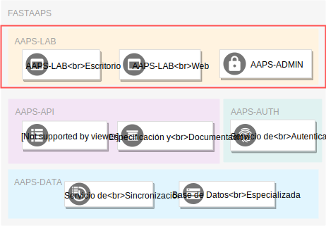

# AAPS-LAB: Resúmen Ejecutivo 

Bienvenido a la documentación del componente de aplicaciones interactivas *AAPS-LAB*!

## General

El componente [**AAPS-LAB**](./summary.md) ...

* Ofrece a sus usuarios aplicaciones interacivas de visualización y manejo de datos.

* Ofrece dos tipos de acceso a las aplicaciones de usuarios:
    + Un programa de escritorio: **AAPS-LAB (desktop)**.
    + Una aplicación web: **AAPS-LAB (web)**.

* Ofrece una aplicación web de manejo de datos (creación, acceso, edición y eliminación) para apoyar las labores de los administradores de datos (**AAPS-ADMIN**).

## Acceso a los Datos

El componente [**AAPS-LAB**](./summary.md) ...

* Hace uso del servicio de datos del componente [**AAPS-API**](../AAPS-API/summary.md) para acceder a los datos del componente [**AAPS-DATA**](../AAPS-DATA/summary.md).

* Hace uso del servicio de autenticación del componente [**AAPS-AUTH**](../AAPS-AUTH/summary.md) para validar la identidad de sus usuarios y controlar sus permisos en el sistema.