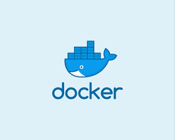

# Docker: Tecnologías de Contenerización

## 1. Información General: ¿Qué es y para qué sirve Docker?

Docker es una plataforma que permite a los desarrolladores empaquetar y correr aplicaciones vía interfaces estandarizadas. 

Docker está basado en tecnologías de virtualización a nivel de sistema operativo que empaqueta software en sus propios entornos virtuales denominados *contenedores*. A diferencia de una *máquina virtual*, un contenedor es más eficiente y ligero porque no replica una máquina física abstracta, sino que simplemente replica un sistema operativo abstracto. De esta manera se puede correr muchos más contenedores en un mismo servidor que maquinas virtuales gozando de las ventajas de aislar cada aplicación en su entorno individual.

El uso de contenedores Docker para la puesta en producción reduce el trabajo de instalación y el uso de scripts de instalación.

Un contenedor Docker es un proceso aislado que corre en el entorno del usuario del sistema operativo y comparte el núcleo (kernel) del sistema con otros procesos. Múltiples contenedores pueden correr en la misma máquina, cada uno corriendo su aplicación en un proceso aislado.

La ventaja de utilizar tecnologías de contenerización para los servicios en producción son:

1. **Bajo índice de acoplamiento (loose coupling)**: Al aislar cada aplicación en su propio entorno virtual, estas son independientes las unas de las otras. Las dependencias de una no interfieren con las dependencias de las otras. Por ejemplo, múltiples servicios del sistema FASTAAPS requieren de una instalación de Python y al aislarlos en sus propios contenedores es posible que cada servicio tenga su propia instalación de Python, posiblemente con distintas versiones, librerías de código instaladas y variables de entorno. 

2. **Consistencia y Replicabilidad (replicablity)**: Al definir explícitamente las dependencias de una aplicación, podemos garantizar que las aplicaciones funcionarán de igual manera en cualquier entorno, sea este de desarrollo, de prueba o de producción.

3. **Facilidad de escalabilidad (scalability)**: Al tener la posibilidad de crear y replicar aplicaciones contenerizadas facilmente, es posible incrementar o reducir el número de copias de un servicio y sus recursos de cómputo de acuerdo a los requerimientos de uso.  

Una desventaja del uso de contenedores es la complejidad de interconexión y monitoreo de servicios. Por suerte, existen tecnologías maduras de manejo y orquestración de servicios contenerizados como [Kubernetes](https://kubernetes.io/).

## 2. Imágenes Base, Servicios y Contenedores Docker del Sistema FASTAAPS

Un contenedor es un proceso aislado creado a partir de una *imágen base* que describe todas sus dependencias y su proceso de instalación. Estas imágenes nos dan la capacidad de crear servicios de manera reproducible y predecible, independientemente de las características particulares de la máquina. Las imágenes base de los contenedores además sirven de documentación técnica.

A continuación listamos las imágenes base usadas para los distintos servicios del sistema FASTAAPS. Algunas imágenes descargadas del repositorio oficial de imágenes Docker, mientras otras son construidas en base a modificaciones de estas imágenes base.

Código de Imágen | Componente | Servicio  | Imágen Base  | Tecnología Utilizada  
---------- | -------- | ----------------- | ------------ | -------------------- 
celery | AAPS-DATA | Servicio de Sincronización | [python:3.8.0](https://hub.docker.com/_/python/) |  Celery/Flower 
[rabbitmq:3.8.1-management](https://hub.docker.com/_/rabbitmq) | AAPS-DATA | Servicio de Sincronización | - | [RabbitMQ](https://www.rabbitmq.com/)  
[edoburu/pgbouncer](https://hub.docker.com/r/edoburu/pgbouncer/dockerfile/) | AAPS-DATA | Servicio de Sincronización | - | [PgBouncer](http://www.pgbouncer.org/)

Sobre estas imágenes base se implementan distintos servicios Docker. Cada servicio corre en un proceso aislado.

Nombre del Servicio  | Imágen Base | Descripción  | Tecnología Utilizada  
------------ | ------------- | ------------ | ----------- 
rabbitmq  | [rabbitmq:3.8.1-management](https://hub.docker.com/_/rabbitmq) | Agente de mensajería (message broker) |  [RabbitMQ](https://www.rabbitmq.com/)   
celery  | celery | Proceso trabajador de Celery | [Celery](http://www.celeryproject.org/)
flower | celery | Herramienta de monitorero de Celery | [Flower](https://flower.readthedocs.io/)
beat | celery | Herramienta de tareas periódicas | [Celery](http://www.celeryproject.org/)
pgbouncer | [edoburu/pgbouncer](https://hub.docker.com/r/edoburu/pgbouncer/dockerfile/) | Gestor de Conexiones para PostgreSQL | [PgBouncer](http://www.pgbouncer.org/)

Los contenedores Docker se comunican entre ellos y con sistemas externos exponiendo los siguientes puertos específicos en el servidor.

Puerto | Protocolo | Servicio Docker | Descripción
----- | ----- | ----- | -------
5672 | AMQP | rabbitmq | Puerto de Mensajería
15672 | HTTP | rabbitmq | Panel de Control de RabbitMQ
5555 | HTTP | celery_flower | Panel de Control de Celery
6432 | postgresql | pgbouncer | Gestor de Conexiones hacia PostgreSQL

## 3. Variables de Configuración

Las variables de configuración de una aplicación de software son aquellos datos que son independientes del funcionamiento de la aplicación, como las URLs de las bases de datos o las llaves de acceso. Estos datos deben ser accesibles para los administradores y por lo general son del tipo dinámico. Además, por seguridad, estos datos no pueden ser incluídos en los repositorios públicos de código. 

De acuerdo a los [12 factores de aplicaciones como servicio](https://12factor.net/), es deseable separar los datos de configuración del código fuente. La manera recomendada de administrar las variables de configuración es a través de *variables de ambiente* (environment variables). Esto garantiza la portabilidad y escalabilidad de la aplicación. Las variables de ambiente tienen la ventaja de poder ser intercambiadas fácilmente entre distintos ambientes de trabajo, son independientes del lenguaje de programación y se integran muy bien con Docker.

!!! info "Los 12 factores de aplicaciones como servicio"
    Los [12 factores de aplicaciones como servicio](https://12factor.net/) son reglas generales para el desarrollo de software basado en una arquitectura de servicios que garantiza la portabilidad y la escalabilidad de los servicios.

    El sistema FastAAPS se adhiere a varios de estos factores de calidad de código. Para más información, véase la sección [calidad de código](FASTAAPS/quality). 

## Archivos Docker de los Servicios

El *archivo de Docker* (en inglés *Dockerfile*) contiene todas las instrucciones necesarias para construir la imágen del contenedor y a su vez sirve de documentación técnica. Estos archivos describen la aplicación y sus dependencias. 

Docker ejecuta las instrucciones de un archivo Docker para contruir la imágen base.

A continuación incluímos los archivos docker que construyen las imágenes base usadas por los servicios del sistema.

