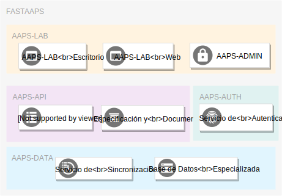

# Inicio

Bienvenido a la documentación del sistema *FastAAPS*!

## General

El sistema [**FastAAPS**](/) ...

* Almacena y Maneja los conjuntos de datos de la institución a través de su componente [**AAPS-DATA**](/AAPS-DATA/summary).

* Proporciona un servicio web de datos basado en especificaciones abiertas que permite a aplicaciones y sistemas externos acceder a los conjuntos de datos de la AAPS almacenados en el sistema. Esta función la realiza su componente [**AAPS-API**](/AAPS-API/summary).

* Controla el acceso a los conjuntos de datos a través de un servicio de autenticación y autorización ofrecido por su componente [**AAPS-AUTH**](/AAPS-AUTH/summary).

* Ofrece a sus usuarios aplicaciones interacivas de visualización y manejo de datos a través de la plataforma [**AAPS-LAB**](/AAPS-LAB/summary).

